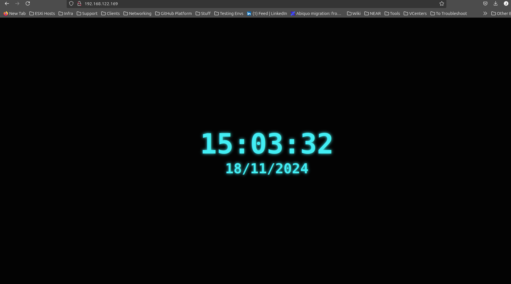

# Deploying the VM: IMG + vm.xml

## 1. Modify the `vm.xml` File

To modify the `vm.xml` file, update the following elements:

### Set the Source File
```xml
<source file='/var/lib/libvirt/images/debian10-ssh.img'/>
```

### Enable Boot
```xml
<bootmenu enable='yes'/>
```

### Enable Console Access
```xml
<serial type='pty'>
  <target port='0'/>
</serial>
<console type='pty'>
  <target type='serial' port='0'/>
</console>
```

## 2. Define and Start the VM

To define and start the virtual machine, follow these steps:

### Define the VM
Run the following command to define the VM:
```sh
virsh define vm.xml
```

### Start the VM
Start the VM using:
```sh
sudo virsh start immfly-debian10
```

## 3. Network Configuration

### Check Network Status
Verify the network status and start the default network if needed:
```sh
sudo virsh net-list --all
sudo virsh net-start default
```

### Enable IP Forwarding
Enable IP forwarding with the following commands:
```sh
sudo sysctl -w net.ipv4.ip_forward=1
echo "net.ipv4.ip_forward = 1" | sudo tee -a /etc/sysctl.conf
```

### Set IPTABLES Rule for VM Internet Access
To enable internet access for the VM, set the following IPTABLES rule:
```sh
sudo iptables -t nat -A POSTROUTING -s 192.168.122.0/24 -o wlo01 -j MASQUERADE
```

### Forwarding Rules
Add forwarding rules to ensure proper packet routing:
```sh
sudo iptables -A FORWARD -s 192.168.122.0/24 -j ACCEPT
sudo iptables -A FORWARD -d 192.168.122.0/24 -j ACCEPT
```

### Restart Libvirt and Networking Services
Restart the networking and libvirt services to apply changes:
```sh
sudo systemctl restart networking
sudo systemctl restart libvirtd
```

## 4. Deploy the VM
Deploy the VM by running the deployment script:
```sh
./deploy.sh
```

## 5. How to Run Playbooks
To run the Ansible playbooks, use the following command:
```sh
docker run --network host --rm \
  -v $(pwd):/ansible \
  -v $SSH_AUTH_SOCK:/ssh-agent \
  -e SSH_AUTH_SOCK=/ssh-agent \
  -e BACKEND_PORT -e LOG_LEVEL \
  ansible-docker /ansible/playbooks/deploy.yml
```

